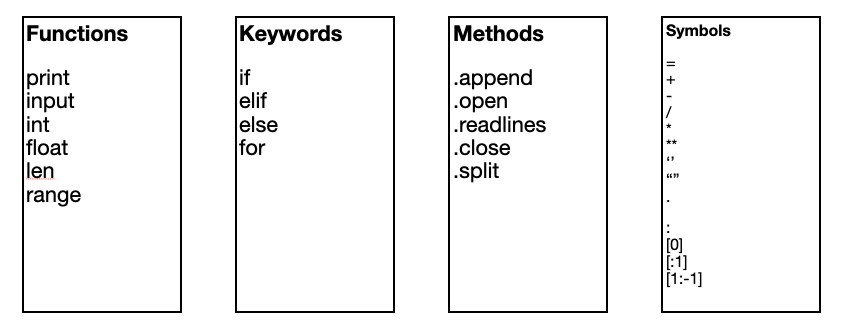

Last week we looked at functions

Remember: identify a function

Why? Functions let you reuse, share your code

## Example (Inventory)

https://repl.it/@NathanE2/herons-formula#main.py

Going back to the inventory example

1. Create a functions.py (graduating from a single file of code)
2. Package the main.py code in a function "find_the_sum_from_inventory"
3. Import if to main.py (with the repl.it repl)

Q: Is that enough? How would we execute the function?

4. Call the function
5. Store the results from the function in a variable and print it out

Q: Why does it print None?

6. Add a return value

7. What if the user wanted to add a sales tax? t = input("") (tax parameter in function)
8. What if the user wanted to specify a filename? filename = input("")
9. What if the user wanted to choose avg vs sum?

## Exercise

Week-7-exercise

## Extra

Functions calling functions

put the if choices inside a function that calls sub-functions

